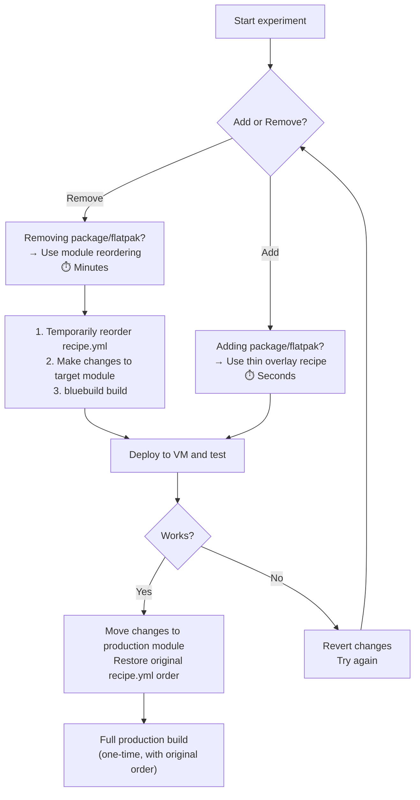

# Build Optimization: Module Reordering + BuildKit Cache

**Date:** 2026-04-30
**Strategy:** Temporarily reorder modules so the experimental one is last, leveraging Docker layer caching
**Best for:** Removing packages/Flatpaks, or when thin overlay isn't suitable

## Concept

Docker builds are sequential — each `RUN` instruction produces a layer. If layer N hasn't changed, Docker reuses its cached version. If layer N changes, layers N+1 through the end must rebuild.

By moving the module you're experimenting with to the **end** of the recipe, you minimize the number of layers that rebuild:

```
Standard order (recipe.yml):
  packages → flatpaks-remove → flatpaks → dotfiles → tabby → moonlight → signing
  ↑ change here = 7 layers rebuild                    ↑ change here = 2 layers rebuild

Experiment order (temporary):
  flatpaks → dotfiles → tabby → moonlight → flatpaks-remove → packages → signing
                                                              ↑ change here = 2 layers rebuild
```

## Build Caching

### Q: Does Docker cache need to be enabled explicitly on MacBook Pro?

**No.** Docker Engine (you're on 29.1.3/28.4.0 via colima) uses BuildKit as the default builder. Local layer caching is automatic:

```bash
# First build — all layers are computed
bluebuild build recipes/recipe.yml --platform linux/amd64

# Second build with NO changes — 100% cached, near-instant
bluebuild build recipes/recipe.yml --platform linux/amd64

# Second build with ONE changed module at the end — only that layer + signing rebuild
bluebuild build recipes/recipe.yml --platform linux/amd64
```

Verify BuildKit is active:
```bash
docker info | grep -i buildkit
# Should show:  BuildKit: true
```

**The catch:** `colima restart`, `docker system prune`, or VM disk pressure clears the local cache. For experimentation sessions, just don't prune between builds.

### Registry Cache: `bluebuild --cache-layers`

`bluebuild build` has **native registry cache support** via `--cache-layers`. This pushes layer cache to your registry so it survives colima restarts and prunes:

```bash
bluebuild build recipes/recipe.yml \
  --platform linux/amd64 \
  --push \
  --registry registry.home.keithmarcus.com \
  --cache-layers
```

> **`--cache-layers` only works with `--push`.** This makes sense — the cache must be stored somewhere, and the registry is that store. Without `--push`, there's no destination for the cache.

**How it works:**

```
First build:
  MacBook (colima) ──build──▶ registry.home.keithmarcus.com
                              ├── bazzite-moonlight:latest  (the image)
                              └── bazzite-moonlight:cache   (layer manifests)

Second build (only one module changed):
  MacBook ◀──cache-from── registry  (pulls cached layers)
          ──rebuild──▶   only changed layers + signing
          ──cache-to──▶  registry  (updates cache)
```

All builds still run on your MacBook. The registry is just cache storage — it never executes builds.

**No auth needed for local registry:** Your `registry.home.keithmarcus.com` (Caddy reverse proxy at `192.168.20.7:80`) is a plain HTTP registry on the LAN. No `--username`/`--password` needed. If you ever use an authenticated registry, add `--username` and `--password`.

**With `--push` and no explicit tags,** bluebuild tags the image as `registry.home.keithmarcus.com/bazzite-moonlight:latest` (derived from the recipe `name` field). The cache is stored alongside it.

### When to Use Each Cache Type

| Scenario | Use |
|----------|-----|
| Quick iteration within one session (no restart) | Local cache (automatic) — just `bluebuild build` |
| Survives `colima restart` or `docker system prune` | `bluebuild build --push --registry ... --cache-layers` |
| CI builds (GitHub Actions) | `--cache-layers` (ephemeral runners) |
| Experimenting with module reordering | Local cache is sufficient — you're in one session |

## Module Reordering Workflows

### Workflow A: Experimenting with DNF Packages (packages.yml)

Move `packages.yml` to the end:

```yaml
# recipes/recipe.yml — TEMPORARY reorder for DNF experiments
modules:
  - from-file: common/flatpaks-remove.yml  # cached
  - from-file: common/flatpaks.yml         # cached
  - from-file: common/dotfiles.yml         # cached
  - from-file: common/tabby.yml            # cached
  - from-file: hosts/moonlight.yml         # cached
  - from-file: common/packages.yml         # ← ONLY this rebuilds
  - type: signing
```

> **⚠️ Important:** `flatpaks-remove.yml` must stay **before** `flatpaks.yml` if it removes Flatpaks that would conflict with installs. Only reorder modules that are independent of each other.

### Workflow B: Experimenting with Flatpaks (flatpaks.yml)

Move the flatpak pair to the end:

```yaml
# recipes/recipe.yml — TEMPORARY reorder for Flatpak experiments
modules:
  - from-file: common/packages.yml         # cached
  - from-file: common/dotfiles.yml         # cached
  - from-file: common/tabby.yml            # cached
  - from-file: hosts/moonlight.yml         # cached
  - from-file: common/flatpaks-remove.yml  # cached
  - from-file: common/flatpaks.yml         # ← ONLY this rebuilds
  - type: signing
```

### Workflow C: Experimenting with Scripts (tabby.yml)

Tabby is already near the end — only tabby + moonlight + signing rebuild:

```yaml
# Current order is already good for script experiments — no reorder needed
modules:
  - from-file: common/packages.yml         # cached
  - from-file: common/flatpaks-remove.yml  # cached
  - from-file: common/flatpaks.yml         # cached
  - from-file: common/dotfiles.yml         # cached
  - from-file: common/tabby.yml            # ← change here
  - from-file: hosts/moonlight.yml         # rebuilds
  - type: signing                          # rebuilds
```

### Workflow D: Experimenting with Dotfiles (dotfiles.yml)

Move dotfiles near the end:

```yaml
# recipes/recipe.yml — TEMPORARY reorder for dotfile experiments
modules:
  - from-file: common/packages.yml         # cached
  - from-file: common/flatpaks-remove.yml  # cached
  - from-file: common/flatpaks.yml         # cached
  - from-file: common/tabby.yml            # cached
  - from-file: hosts/moonlight.yml         # cached
  - from-file: common/dotfiles.yml         # ← ONLY this rebuilds
  - type: signing
```

## Full Experimentation Loop



## Best Practices

1. **Always restore original module order after experimentation.** The production [`recipe.yml`](../recipes/recipe.yml) should have the canonical order. Use `git diff` to review before committing.

2. **Don't reorder interdependent modules.** `flatpaks-remove.yml` must come before `flatpaks.yml`. `signing` must be last. Only reorder modules that are truly independent.

3. **Keep a baseline build handy.** After a successful full build with `--push`, the image is already in your registry. Tag a baseline copy for quick rollback:
   ```bash
   # If you built with --push, the image is already at the registry.
   # Create a baseline tag for quick rollback:
   docker pull registry.home.keithmarcus.com/bazzite-moonlight:latest
   docker tag registry.home.keithmarcus.com/bazzite-moonlight:latest \
     registry.home.keithmarcus.com/bazzite-moonlight:baseline
   docker push registry.home.keithmarcus.com/bazzite-moonlight:baseline
   ```

4. **Avoid `docker system prune` during experimentation sessions.** It clears the local layer cache and forces a full rebuild.

5. **Use `docker history` to verify caching is working:**
   ```bash
   docker history localhost/bazzite-moonlight:latest
   # Layers built from cache show "CACHED" in the output
   ```

## Troubleshooting

| Symptom | Likely Cause | Fix |
|---------|-------------|-----|
| All layers rebuild every time | `docker system prune` was run | Don't prune during experiments |
| Cache misses after `colima restart` | Local cache doesn't survive restart | Use `bluebuild build --push --registry ... --cache-layers` |
| `--cache-layers` has no effect | Missing `--push` flag | `--cache-layers` only works with `--push` |
| "CACHED" layers still take time | DNF/flatpak metadata refresh even on cache hit | Expected — network checks are part of the layer |
| Registry push fails with TLS error | Local registry uses HTTP, Docker expects HTTPS | Add registry to colima insecure registries, or use Caddy TLS endpoint |

---

_See also: [Thin Overlay Recipe](./build-optimization-thin-overlay.md) for faster "add" experiments_
