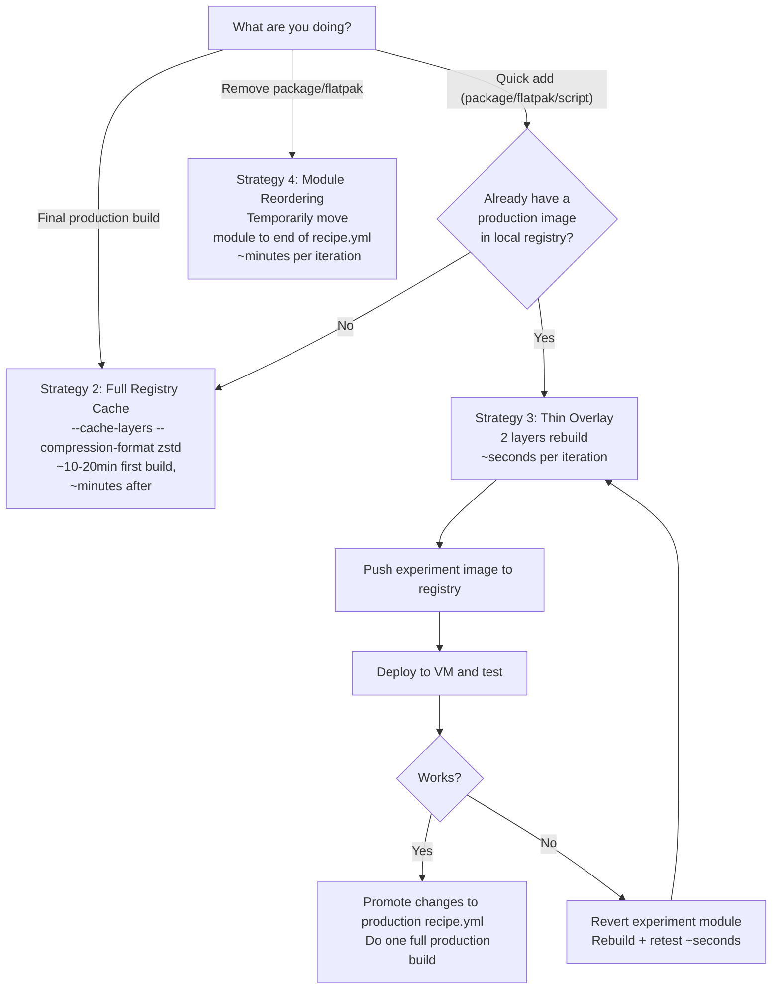
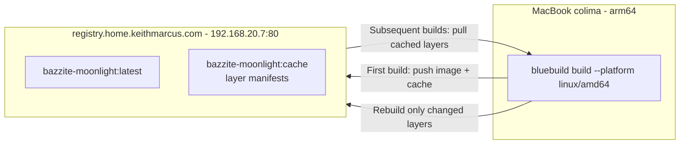
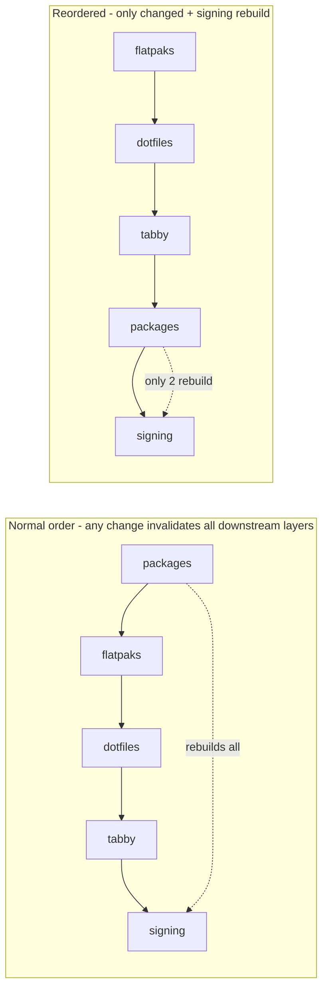
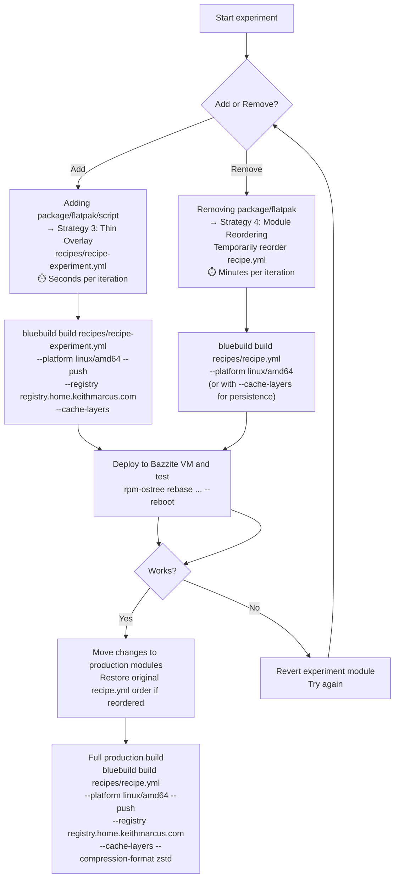

# Build Optimization: Local Registry Cache & Iteration Strategies

**Date:** 2026-05-03
**Target:** Optimizing `bluebuild build` iteration speed using the local LAN registry at `registry.home.keithmarcus.com`
**Scope:** Covers all optimization strategies — local cache, registry cache, thin overlays, module reordering, and advanced CLI flags

> **Supersedes:**
> - [`docs/build-optimization-module-reordering.md`](build-optimization-module-reordering.md) (module reordering + BuildKit cache)
> - [`docs/build-optimization-thin-overlay.md`](build-optimization-thin-overlay.md) (thin overlay recipe)

---

## Table of Contents

- [Understanding Build Caching](#understanding-build-caching)
- [Strategy Decision Flowchart](#strategy-decision-flowchart)
- [Strategy 1: Local BuildKit Cache (Automatic)](#strategy-1-local-buildkit-cache-automatic)
- [Strategy 2: Registry Cache with `--cache-layers`](#strategy-2-registry-cache-with---cache-layers)
- [Strategy 3: Thin Overlay Recipe](#strategy-3-thin-overlay-recipe)
- [Strategy 4: Module Reordering](#strategy-4-module-reordering)
- [Advanced CLI Options](#advanced-cli-options)
- [Strategy Selection Matrix](#strategy-selection-matrix)
- [Full Iteration Loop](#full-iteration-loop)
- [Troubleshooting](#troubleshooting)

---

## Understanding Build Caching

Docker builds are sequential — each module in the `recipe.yml` list produces a layer. If layer N hasn't changed since the last build, Docker reuses its cached version. If layer N changes, layers N+1 through the end must rebuild.

```
Modules in recipe.yml execution order:
  packages → flatpaks → dotfiles → tabby → signing
    cached    cached    rebuild    rebuild   rebuild
    ↑ unchanged  ↑ unchanged  ↑ changed
```

### Where cache lives

| Cache type | Location | Survives `colima restart`? | Survives `docker system prune`? |
|------------|----------|---------------------------|-------------------------------|
| Local BuildKit | colima VM disk | ❌ | ❌ |
| Registry | `registry.home.keithmarcus.com` | ✅ | ✅ |

### Overview of strategies (fastest → slowest)

```
                  ╔══════════════════════════════════╗
   ⚡ Fastest     ║ Thin overlay + registry cache    ║ ~seconds
                  ║ Thin overlay (local cache)       ║ ~seconds
                  ╠══════════════════════════════════╣
   ⚡ Fast        ║ Module reorder + local cache     ║ ~minutes
                  ║ Module reorder + registry cache  ║ ~minutes
                  ╠══════════════════════════════════╣
   ⚡ Baseline    ║ Full build (local cache)         ║ ~10-20min
                  ║ Full build (registry cache)      ║ ~10-20min
                  ╚══════════════════════════════════╝
```

---

## Strategy Decision Flowchart



---

## Strategy 1: Local BuildKit Cache (Automatic)

**Best for:** Quick iteration within a single session (no colima restarts or prunes between builds)

Docker Engine via colima uses BuildKit as the default builder. Local layer caching is automatic and requires no flags:

```bash
# First build — all layers are computed
bluebuild build recipes/recipe.yml --platform linux/amd64

# Second build with NO changes — 100% cached, near-instant
bluebuild build recipes/recipe.yml --platform linux/amd64

# Second build with ONE changed module at the end — only that layer + signing rebuild
bluebuild build recipes/recipe.yml --platform linux/amd64
```

Verify BuildKit is active:
```bash
docker info | grep -i buildkit
# Should show:  BuildKit: true
```

**The catch:** `colima restart`, `docker system prune`, or colima VM disk pressure clears the local cache. For experimentation sessions, don't prune between builds.

**Limitation:** Only helps you on the Mac build host. The Bazzite VM never benefits from this cache.

---

## Strategy 2: Registry Cache with `--cache-layers`

**Best for:** Surviving colima restarts, prunes, and CI-like workflows where local cache is unreliable

`bluebuild build` has native registry cache support via `--cache-layers`. This pushes layer cache to your registry so it persists independently of the local colima VM:

```bash
bluebuild build recipes/recipe.yml \
  --platform linux/amd64 \
  --push \
  --registry registry.home.keithmarcus.com \
  --cache-layers
```

> **`--cache-layers` only works with `--push`.** The cache must be stored somewhere, and the registry is that store. Without `--push`, there's no destination for the cache.

### How it works



**First build** — all layers are computed and pushed:
- `registry.home.keithmarcus.com/bazzite-moonlight:latest` — the image
- `registry.home.keithmarcus.com/bazzite-moonlight:cache*` — layer manifests

**Subsequent builds** — only changed layers rebuild and push. Cached layers are pulled from the registry.

**No auth needed:** Your `registry.home.keithmarcus.com` is a plain HTTP registry on the LAN. No `--username`/`--password` required. If you ever use an authenticated registry, add those flags.

### Optimal variant with all performance flags

```bash
bluebuild build recipes/recipe.yml \
  --platform linux/amd64 \
  --push \
  --registry registry.home.keithmarcus.com \
  --cache-layers \
  --compression-format zstd \
  --retry-push
```

See [Advanced CLI Options](#advanced-cli-options) for what each flag does.

---

## Strategy 3: Thin Overlay Recipe

**Best for:** Adding packages, Flatpaks, or scripts during active experimentation — 1-2 layer rebuilds instead of 7

Instead of rebuilding all 7 layers from scratch, use your already-built production image as the base. Only the experimental module is layered on top:

```
Standard build (7 layers rebuild):
  bazzite-gnome:stable-44 → packages → flatpaks → dotfiles → tabby → signing

Thin overlay (1-2 layers rebuild):
  bazzite-moonlight:latest → experiment → signing
  ↑ already has all 7 layers baked in
```

### When thin overlay works

| Experiment type | Thin overlay works? |
|-----------------|:---:|
| Adding a new RPM package | ✅ |
| Adding a new Flatpak | ✅ |
| Adding a new script module | ✅ |
| Changing a script | ✅ |
| Changing dotfiles | ✅ |
| Changing GNOME extensions | ✅ |
| Removing an RPM package | ❌ — can't remove base image packages from overlay |
| Removing a Flatpak installed in base | ❌ — use Strategy 4 instead |

### Setup files

#### 1. Experiment module (`recipes/common/packages-experiment.yml`)

```yaml
---
# yaml-language-server: $schema=https://schema.blue-build.org/module-v1.json
# TEMPORARY: Experiment module — add packages/flatpaks here for testing.
# Once confirmed working, move them to the production recipe.

type: dnf
# Uncomment and add packages you're testing:
# install:
#   packages:
#     - <package-to-test>
```

For Flatpak experiments, create `recipes/common/flatpaks-experiment.yml`:

```yaml
---
# yaml-language-server: $schema=https://schema.blue-build.org/module-v1.json
# TEMPORARY: Flatpak experiment module

type: managed-flatpaks
configurations:
  - notify: false
    scope: system
    install:
      # - <flatpak-id-to-test>
```

#### 2. Experiment recipe (`recipes/recipe-experiment.yml`)

```yaml
---
# yaml-language-server: $schema=https://schema.blue-build.org/recipe-v1.json
# EXPERIMENT RECIPE — uses production image as base.
# Only the experiment module + signing rebuild on each change.

name: bazzite-moonlight-experiment
description: Experiment overlay — do not use in production.

# Use the production image as base (local registry for speed)
base-image: registry.home.keithmarcus.com/bazzite-moonlight
image-version: latest

modules:
  - from-file: common/packages-experiment.yml  # ← change this module
  # - from-file: common/flatpaks-experiment.yml  # ← or this one
  - type: signing
```

> **Note:** Add experiment files to `.gitignore` to keep them out of version control:
> ```
> recipes/recipe-experiment.yml
> recipes/common/packages-experiment.yml
> recipes/common/flatpaks-experiment.yml
> ```

### Build and deploy the thin overlay

```bash
# 1. Pull latest production image to local registry (one-time, or when stale)
docker pull ghcr.io/keithmarcusxiii/bazzite-moonlight:latest
docker tag ghcr.io/keithmarcusxiii/bazzite-moonlight:latest \
  registry.home.keithmarcus.com/bazzite-moonlight:latest
docker push registry.home.keithmarcus.com/bazzite-moonlight:latest

# 2. Build, push, and cache the thin overlay (seconds)
cd bazzite-moonlight
bluebuild build recipes/recipe-experiment.yml \
  --platform linux/amd64 \
  --push \
  --registry registry.home.keithmarcus.com \
  --cache-layers \
  --compression-format zstd \
  --retry-push

# 3. On the Bazzite VM, rebase to the experiment image
rpm-ostree rebase ostree-unverified-image:registry:registry.home.keithmarcus.com/bazzite-moonlight-experiment:latest
systemctl reboot
```

### Cleanup after experimentation

```bash
# Clear the experiment module for next time
echo "" > recipes/common/packages-experiment.yml

# On the VM, rebase back to production
rpm-ostree rebase ostree-unverified-image:registry:registry.home.keithmarcus.com/bazzite-moonlight:latest
systemctl reboot
```

---

## Strategy 4: Module Reordering

**Best for:** Removing packages or Flatpaks (which thin overlay cannot handle)

**Concept:** Temporarily reorder `recipes/recipe.yml` so the module you're changing is executed last. This minimizes the number of layers that rebuild on each iteration:



### Experimenting with DNF packages

```yaml
# recipes/recipe.yml — TEMPORARY reorder for DNF experiments
modules:
  - from-file: common/flatpaks.yml         # cached
  - from-file: common/dotfiles.yml         # cached
  - from-file: common/tabby.yml            # cached
  - from-file: hosts/moonlight.yml         # cached
  - from-file: common/packages.yml         # ← ONLY this rebuilds
  - type: signing
```

> **⚠️ Important:** `flatpaks-remove.yml` must stay **before** `flatpaks.yml` if it removes Flatpaks that would conflict with installs. Only reorder modules that are independent.

### Experimenting with Flatpaks

```yaml
# recipes/recipe.yml — TEMPORARY reorder for Flatpak experiments
modules:
  - from-file: common/packages.yml         # cached
  - from-file: common/dotfiles.yml         # cached
  - from-file: common/tabby.yml            # cached
  - from-file: hosts/moonlight.yml         # cached
  - from-file: common/flatpaks.yml         # ← ONLY this rebuilds
  - type: signing
```

### Experimenting with dotfiles

```yaml
# recipes/recipe.yml — TEMPORARY reorder for dotfile experiments
modules:
  - from-file: common/packages.yml         # cached
  - from-file: common/flatpaks.yml         # cached
  - from-file: common/tabby.yml            # cached
  - from-file: hosts/moonlight.yml         # cached
  - from-file: common/dotfiles.yml         # ← ONLY this rebuilds
  - type: signing
```

### Build command

```bash
# With local cache (fastest, works within one session)
bluebuild build recipes/recipe.yml --platform linux/amd64

# With registry cache (survives restarts)
bluebuild build recipes/recipe.yml \
  --platform linux/amd64 \
  --push \
  --registry registry.home.keithmarcus.com \
  --cache-layers
```

**Always restore original module order after experimentation.** Use `git diff` to review before committing.

---

## Advanced CLI Options

These `bluebuild build` flags are explored below — not yet incorporated into the standard workflow, but available when specific needs arise.

### `--compression-format zstd`

| | Default (gzip) | Alternative (zstd) |
|---|---|---|
| Compression ratio | Better | Slightly worse (5-10% larger) |
| Decompression speed | Baseline | ~3× faster |
| CPU impact during build | Lower | Higher (compress) / lower (decompress) |

Zstd decompresses significantly faster than gzip. Since your layer cache traverses the LAN, this directly reduces push/pull latency. Especially beneficial on emulated x86_64 builds where CPU is already the bottleneck:

```bash
bluebuild build recipes/recipe.yml \
  --platform linux/amd64 \
  --push \
  --registry registry.home.keithmarcus.com \
  --cache-layers \
  --compression-format zstd
```

### `--squash`

Collapses all layers into one. Drastically alters cache semantics — you either hit 100% or rebuild everything. **Not recommended during iteration.** Only useful for final minimal image size when pushing to an air-gapped registry.

> ⚠️ `--squash` is **deprecated on the Docker driver**. Switching to `--build-driver podman` would be required. Your colima setup uses Docker — so this option is effectively unavailable.

### `--build-chunked-oci` + `--max-layers`

Uses `rpm-ostree compose build-chunked-oci` to rechunk the image into smaller, content-addressed chunks. Benefits **consumers** pulling updates (smaller delta downloads) — not the build cache itself:

```bash
bluebuild build recipes/recipe.yml \
  --platform linux/amd64 \
  --push \
  --registry registry.home.keithmarcus.com \
  --cache-layers \
  --build-chunked-oci \
  --max-layers 128
```

**Trade-off:** Longer build time + more disk during build. Only worth it for images deployed to multiple systems or over slow WAN links. For a single Bazzite VM on the same LAN, the benefit is minimal.

### `--remove-base-image`

Frees disk space in colima after the image is built but before rechunking. Only relevant when combined with `--build-chunked-oci` (which needs extra space):

```bash
bluebuild build recipes/recipe.yml \
  --platform linux/amd64 \
  --push \
  --registry registry.home.keithmarcus.com \
  --cache-layers \
  --build-chunked-oci \
  --remove-base-image
```

**Risky:** If build fails during rechunking, you'd need to re-pull the multi-GB base image.

### `--retry-push`

Your LAN registry at `192.168.20.7:80` is generally stable, but if the connection is ever flaky, a single retry (the default when `--retry-push` is enabled) prevents a multi-minute build from being wasted:

```bash
bluebuild build recipes/recipe.yml \
  --platform linux/amd64 \
  --push \
  --registry registry.home.keithmarcus.com \
  --cache-layers \
  --retry-push
```

The `--retry-count` option defaults to 1 (one retry). For a LAN registry, that's sufficient -- if the first retry fails, the registry is genuinely down and more retries just add timeout wait time.

### `--tempdir`

Override the temporary build directory. Useful if colima's default `/tmp` is on a slow volume:

```bash
bluebuild build recipes/recipe.yml \
  --tempdir /path/to/faster/disk
```

For most builds the impact is marginal. Only consider this if you routinely see disk I/O as a bottleneck.

---

## Strategy Selection Matrix

| Scenario | Strategy | Command | Iteration speed |
|----------|----------|---------|-----------------|
| Adding a package/flatpak/script — first build | Thin overlay | `bluebuild build recipes/recipe-experiment.yml --platform linux/amd64 --push --registry registry.home.keithmarcus.com --cache-layers` | ⚡ Seconds |
| Adding — subsequent iterations (same session) | Thin overlay (local cache) | Same command — BuildKit auto-caches locally | ⚡ Seconds |
| Adding — after colima restart | Thin overlay (registry cache) | Same command — `--cache-layers` pulls from registry | ⚡ Seconds |
| Removing a package | Module reorder + build | `bluebuild build recipes/recipe.yml --platform linux/amd64` | ⏱ Minutes |
| Removing — after colima restart | Module reorder + registry cache | Add `--push --registry ... --cache-layers` | ⏱ Minutes |
| Final production build | Full registry cache + zstd | `bluebuild build recipes/recipe.yml --platform linux/amd64 --push --registry registry.home.keithmarcus.com --cache-layers --compression-format zstd --retry-push` | ⏱ 10-20min first, ~minutes after |
| CI-like repeatable build | Registry cache + all flags | Full command with `--compression-format zstd --retry-push` | ⏱ ~minutes after first |
| Multi-system deployment | Add chunked OCI | Same as full build + `--build-chunked-oci --max-layers 128` | 🐢 ~20-30min |

---

## Full Iteration Loop



---

## Troubleshooting

| Symptom | Likely Cause | Fix |
|---------|-------------|-----|
| All layers rebuild every time | `docker system prune` was run | Don't prune during experiments. Or use `--cache-layers` with registry |
| Cache misses after `colima restart` | Local cache doesn't survive restart | Use `bluebuild build --push --registry ... --cache-layers` |
| `--cache-layers` has no effect | Missing `--push` flag | `--cache-layers` only works with `--push` |
| "CACHED" layers still take time | DNF/flatpak metadata refresh even on cache hit | Expected — network checks are part of the layer |
| Registry push fails with TLS error | Local registry uses HTTP, Docker expects HTTPS | Add registry to colima insecure registries, or use the Caddy TLS hostname |
| `docker push 192.168.20.7:80/...` fails with HTTP error | Docker requires `insecure-registries` config for HTTP | Add `192.168.20.7:80` to colima config under `docker.insecure-registries`, then `colima restart`. Or use the hostname endpoint `registry.home.keithmarcus.com` which has TLS via Caddy |
| Thin overlay can't remove packages/flatpaks | Removing from base image is not supported in an overlay | Use Strategy 4 (module reordering) instead |
| Experiment image not found on VM | Registry push failed or wrong tag | Check `docker push` output. Verify with `curl https://registry.home.keithmarcus.com/v2/_catalog` |
| VM can't resolve `registry.home.keithmarcus.com` | DNS issue on Bazzite | Check `dig registry.home.keithmarcus.com`. Add `/etc/hosts` entry: `192.168.20.7 registry.home.keithmarcus.com` |
| `docker history` doesn't show "CACHED" | BuildKit cache was invalidated | Check `docker info \| grep -i buildkit`. If false, colima may not have BuildKit enabled. Or use `--cache-layers` as a fallback |

---

_See also: [Development Guide](development-guide.md) for full local build setup and VM deployment workflows_
