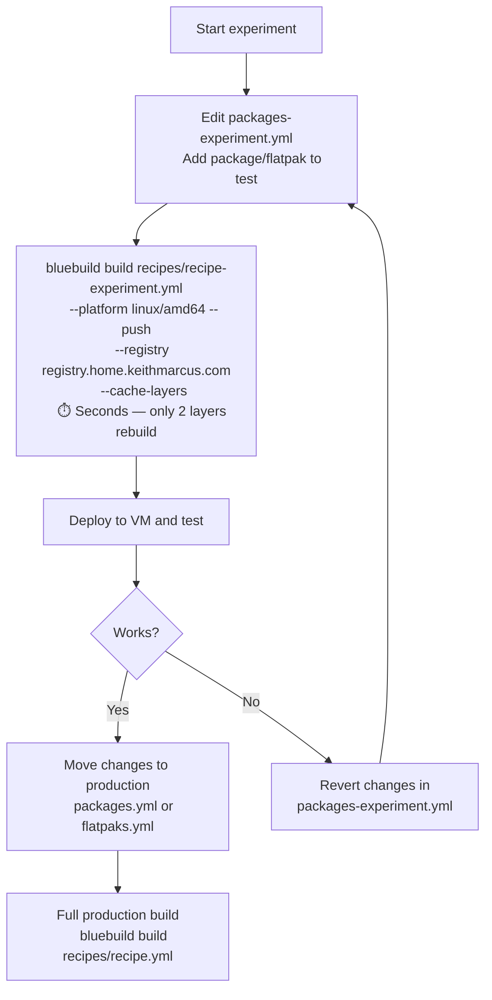

# Build Optimization: Thin Overlay Recipe

**Date:** 2026-04-30
**Strategy:** Use production image as base, layer only experimental modules
**Best for:** Adding packages, Flatpaks, or scripts during active experimentation

## Concept

Instead of rebuilding all 7 layers from scratch for every experiment, use your already-built production image as the base. Only the experimental module is layered on top — a 1-2 layer build instead of 7.

```
Standard build (7 layers rebuild):
  bazzite-gnome:stable-44 → packages → flatpaks-remove → flatpaks
                          → dotfiles → tabby → moonlight → signing

Thin overlay (1-2 layers rebuild):
  bazzite-moonlight:latest → experiment → signing
  ↑ already has all 7 layers baked in
```

## When to Use

| Experiment type | Thin overlay works? |
|-----------------|:---:|
| Adding a new RPM package | ✅ |
| Adding a new Flatpak | ✅ |
| Adding a new script module | ✅ |
| Changing a script (Tabby, etc.) | ✅ |
| Removing an RPM package | ❌ — can't remove base image packages from overlay |
| Removing a Flatpak installed in base | ❌ — use module reordering instead |
| Changing dotfiles | ✅ |
| Changing GNOME extensions | ✅ |

## Files to Create

### 1. Experimental Module (`recipes/common/packages-experiment.yml`)

A minimal module for testing one change at a time:

```yaml
---
# yaml-language-server: $schema=https://schema.blue-build.org/module-v1.json
# TEMPORARY: Experiment module — add packages/flatpaks here for testing.
# Once confirmed working, move them to the production recipe.

type: dnf
# Uncomment and add packages you're testing:
# install:
#   packages:
#     - <package-to-test>
# remove:
#   packages: []
#   auto-remove: true
```

For Flatpak experiments, create `recipes/common/flatpaks-experiment.yml`:

```yaml
---
# yaml-language-server: $schema=https://schema.blue-build.org/module-v1.json
# TEMPORARY: Flatpak experiment module

type: default-flatpaks
configurations:
  - notify: false
    scope: system
    install:
      # - <flatpak-id-to-test>
```

### 2. Experiment Recipe (`recipes/recipe-experiment.yml`)

```yaml
---
# yaml-language-server: $schema=https://schema.blue-build.org/recipe-v1.json
# EXPERIMENT RECIPE — uses production image as base.
# Only the experiment module + signing rebuild on each change.

name: bazzite-moonlight-experiment
description: Experiment overlay — do not use in production.

# Use the production image as base (local registry for speed)
base-image: registry.home.keithmarcus.com/bazzite-moonlight
image-version: latest

modules:
  - from-file: common/packages-experiment.yml  # ← change this module
  # - from-file: common/flatpaks-experiment.yml  # ← or this one
  - type: signing
```

> **Note:** If the local registry doesn't have the latest production image, pull it first:
> ```bash
> docker pull ghcr.io/keithmarcusxiii/bazzite-moonlight:latest
> docker tag ghcr.io/keithmarcusxiii/bazzite-moonlight:latest \
>   registry.home.keithmarcus.com/bazzite-moonlight:latest
> docker push registry.home.keithmarcus.com/bazzite-moonlight:latest
> ```

## Workflow



### Step-by-Step

```bash
# 1. Pull the latest production image to local registry (one-time or when stale)
docker pull ghcr.io/keithmarcusxiii/bazzite-moonlight:latest
docker tag ghcr.io/keithmarcusxiii/bazzite-moonlight:latest \
  registry.home.keithmarcus.com/bazzite-moonlight:latest
docker push registry.home.keithmarcus.com/bazzite-moonlight:latest

# 2. Add your test package to packages-experiment.yml
#    e.g., install: packages: [htop]

# 3. Build, push, and cache the thin overlay in one command (seconds)
cd bazzite-moonlight
bluebuild build recipes/recipe-experiment.yml \
  --platform linux/amd64 \
  --push \
  --registry registry.home.keithmarcus.com \
  --cache-layers

# 4. On the VM, rebase to the experiment image
rpm-ostree rebase ostree-unverified-image:registry:registry.home.keithmarcus.com/bazzite-moonlight-experiment:latest
systemctl reboot

# 5. If it works: copy the package to packages.yml, do one full production build
#    If it doesn't: revert packages-experiment.yml, rebuild (seconds), repeat
```

## Cleanup After Experimentation

Once the experiment is validated and promoted to production:

```bash
# Clear the experiment module for next time
echo "" > recipes/common/packages-experiment.yml  # or restore from git

# Optionally clean up experiment images from local registry
# (they'll be overwritten on next experiment anyway)
```

## Limitations

1. **Cannot remove packages from the base image.** The production image's RPM packages are baked in at the rpm-ostree level. An overlay recipe can only add, not remove. For removals, use the [module reordering strategy](./build-optimization-module-reordering.md).

2. **Cannot remove Flatpaks installed in the production base.** Same reason — they're baked into `/var/lib/flatpak` of the base image. Use module reordering for Flatpak removals.

3. **Base image must be up-to-date.** If the production recipe has changed since the last full build, pull the latest production image first.

4. **Experiment image is unsigned.** The signing module is included but may not have a valid key in the experiment workflow. Don't use experiment images in production.

## Integration with CI

The experiment recipe is **local-only** — it should not be added to the GitHub Actions build matrix. Add it to `.gitignore` if you want to keep it out of version control:

```gitignore
# Experiment files (local only)
recipes/recipe-experiment.yml
recipes/common/packages-experiment.yml
recipes/common/flatpaks-experiment.yml
```

---

_See also: [Module Reordering + BuildKit Cache](./build-optimization-module-reordering.md) for removal experiments_
