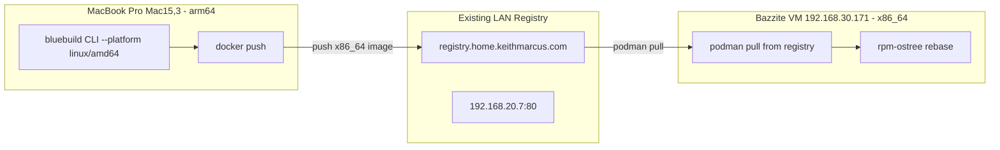

# bazzite-moonlight — Development Guide

**Date:** 2026-04-26
**Project Type:** Infrastructure-as-Code (BlueBuild Custom OS Image)

## Prerequisites

### For Image Consumers
- A Fedora Atomic or Bazzite system (any variant)
- Internet connectivity for `rpm-ostree rebase` and image pulls
- `cosign` CLI (optional, for signature verification)

### For Image Developers
- Git
- A GitHub account with access to the repository
- Understanding of YAML and BlueBuild recipe schema
- Familiarity with rpm-ostree layering, Flatpak, and chezmoi

## Environment Setup

### Clone the Repository

```bash
git clone https://github.com/keithmarcusxiii/bazzite-moonlight.git
cd bazzite-moonlight
```

### Initialize the Dotfiles Subtree

The dotfiles repository at `dotfiles/` is managed as a git subtree (referenced in the chezmoi recipe [`common-dotfiles.yml`](../recipes/common-dotfiles.yml)). After cloning the main project, add the subtree the first time:

```bash
# First-time setup — registers the subtree in the host repo:
git subtree add --prefix=dotfiles https://github.com/KeithMarcusXIII/dotfiles.git main

# Subsequent updates — pull latest changes from the dotfiles remote:
git subtree pull --prefix=dotfiles https://github.com/KeithMarcusXIII/dotfiles.git main
```

`git subtree add` creates the `dotfiles/` directory and registers it as a subtree in the host repo. After that, `git subtree pull` fetches updates. Changes made inside `dotfiles/` should be committed and pushed from within that directory — the subtree maintains its own history on GitHub.

> **Note:** The `dotfiles/` directory with its own `.git` is tracked as a single merge commit in the host repo. The dotfiles repo's full history remains on GitHub and is only squashed into the host on add/pull.

### Repository Configuration

The primary build pipeline runs in GitHub Actions. However, **local builds are fully supported** via the [`bluebuild` CLI](https://blue-build.org/how-to/local/) — enabling fast iteration without waiting for CI, and working around intermittent network or daemon issues.

### Required Secrets (GitHub)

| Secret Name | Location | Purpose |
|-------------|----------|---------|
| `SIGNING_SECRET` | Repository Settings → Secrets → Actions | cosign private key for image signing |
| `github.token` | Auto-provided by GitHub Actions | Push to GHCR |

## Development Workflow

### Making Changes

1. **Edit recipes** in the [`recipes/`](../recipes/) directory
2. **Add system files** in [`files/system/`](../files/system/)
3. **Add scripts** in [`files/scripts/`](../files/scripts/)
4. **Commit and push** to trigger an automatic build
5. **Monitor** the build in the Actions tab of GitHub

> **Note:** Changes to `.md` files only will NOT trigger a build (configured in [`build.yml`](../.github/workflows/build.yml))

### Build Triggers

| Trigger | Behavior |
|---------|----------|
| **Push** (non-`.md`) | Automatic build |
| **Pull Request** | Build for validation |
| **Daily Cron** (06:00 UTC) | Scheduled rebuild |
| **workflow_dispatch** | Manual trigger via GitHub UI |

### Concurrency

Only one build runs at a time. If a new build is triggered while another is in progress, the in-progress build is cancelled. This is controlled by:
```yaml
concurrency:
  group: ${{ github.workflow }}-${{ github.ref || github.run_id }}
  cancel-in-progress: true
```

## Recipe Development

### Recipe Schema

All recipes use the BlueBuild v1 schema:
```yaml
# yaml-language-server: $schema=https://schema.blue-build.org/recipe-v1.json
```

### Module Types

| Module Type | File | What It Does |
|-------------|------|-------------|
| **dnf** | `common-packages.yml` | Install/remove RPM packages via rpm-ostree |
| **default-flatpaks** | `common-flatpaks.yml` | Pre-install Flatpak applications |
| **chezmoi** | `common-dotfiles.yml` | Sync dotfiles from a Git repository |
| **signing** | (built-in) | Set up signing policies for signed images |

### Adding a New Module

1. Create a new YAML file in [`recipes/`](../recipes/)
2. Add the file to the `modules` list in [`recipe.yml`](../recipes/recipe.yml):
   ```yaml
   modules:
     - from-file: common-packages.yml
     - from-file: common-flatpaks.yml
     - from-file: your-new-module.yml  # ← Add here
   ```
3. Modules are executed in order — position matters

### Package Management (DNF)

In [`common-packages.yml`](../recipes/common-packages.yml):
```yaml
type: dnf
repos:
  copr:
    enable:
      - <copr-repo-name>
install:
  packages:
    - <package-name>
remove:
  packages:
    - <package-to-remove>
```

Currently configured:
- **Repos enabled:** `jdxcode/mise` (COPR)
- **Installed:** `stow`, `papirus-icon-theme`, `mise`
- **Removed:** `hhd`, `hhd-ui`

### Flatpak Management

In [`common-flatpaks.yml`](../recipes/common-flatpaks.yml):
```yaml
type: default-flatpaks
configurations:
  - notify: false
    scope: system
    install:
      - io.github.celluloid_player.Celluloid
```

- **`scope: system`** — Available to all users, cannot be removed by users
- **`notify: false`** — Suppress desktop notification after install
- **`scope: user`** — Per-user Flatpaks (currently empty)

### Dotfile Management (chezmoi)

In [`common-dotfiles.yml`](../recipes/common-dotfiles.yml):
```yaml
type: chezmoi
repository: "https://github.com/KeithMarcusXIII/dotfiles.git"
all-users: true
file-conflict-policy: replace
```

- **`all-users: true`** — Enables `chezmoi-init.service` and `chezmoi-update.timer` for all users
- **`file-conflict-policy: replace`** — Overwrites existing files with dotfile versions

### GNOME Extensions

In [`gnome-extensions.yml`](../recipes/gnome-extensions.yml):
- Currently empty — add GNOME Shell extension IDs here

## Custom Modules

The [`modules/`](../modules/) directory holds custom BlueBuild module definitions. Add custom modules here when the built-in types (dnf, flatpak, chezmoi, etc.) don't cover your needs.

## Testing

### CI-Based Testing (GitHub Actions)

The standard path for validating changes — push to a branch and let CI handle the build:

1. Push changes to a branch
2. Wait for the PR build to complete
3. Test the built image by rebasing a test system:
   ```bash
   rpm-ostree rebase ostree-unverified-registry:ghcr.io/keithmarcusxiii/bazzite-moonlight:pr-<PR_NUMBER>
   systemctl reboot
   ```

PR builds are automatically published to GHCR with a `pr-<number>` tag for testing before merge.

### Local Build & Test (bluebuild CLI)

The [`bluebuild` CLI](https://blue-build.org/how-to/local/) enables building images entirely on your local machine — bypassing GitHub Actions, slow network pulls, and transient `rpm-ostree`/`podman` issues. This is the **preferred workflow** during rapid iteration or when GitHub Actions builds are stalled.

#### Prerequisites

| Requirement | Notes |
|-------------|-------|
| `bluebuild` CLI | Install from [blue-build.org](https://blue-build.org/how-to/local/) |
| `colima` | Container runtime on the Mac. Config: `runtime: docker`, `rosetta: true`, `binfmt: true`, `vmType: vz`. Provides Docker CLI and x86_64 emulation. |
| `docker` CLI | Colima exposes the Docker socket — all Mac-side commands use `docker`. |
| Local Bazzite VM | Proxmox VM at `192.168.30.171` / `bazzite.local.keithmarcus.com`. Uses `podman` natively. |
| Cross-arch emulation | Build host is `arm64` (Apple Silicon); target is `x86_64`. Colima's `rosetta: true` and `binfmt: true` provide transparent emulation. `bluebuild` supports `--platform linux/amd64` natively. |

#### Step-by-Step: Build Locally

1. **Build the image** from the recipe, targeting `x86_64`:

   ```bash
   cd bazzite-moonlight
   bluebuild build recipes/recipe.yml --platform linux/amd64
   ```

   This produces a local container image tagged `bazzite-moonlight:latest` in colima's docker storage.

2. **Verify the image exists locally and check its architecture:**

   ```bash
   docker images localhost/bazzite-moonlight

   # Confirm the image is amd64, not arm64
   docker inspect localhost/bazzite-moonlight:latest --format '{{.Architecture}}'
   # Must output: amd64
   ```

#### Step-by-Step: Deploy to the Test VM

The test VM (`192.168.30.171` / `bazzite.local.keithmarcus.com`) is an existing Proxmox VM with a Bazzite installation. Three deployment strategies are available, listed from lowest to highest latency.



##### Strategy C: Push to existing LAN registry — lowest latency, recommended

This strategy leverages the existing container registry at `registry.home.keithmarcus.com` (reverse-proxied by Caddy, upstream at `192.168.20.7:80`). The Mac pushes the locally-built image to it, and the Bazzite VM pulls directly over the LAN. No image data touches the internet, layers are cached, and incremental rebuilds transfer only changed layers.

> **⚠️ Architecture mismatch:** The build host (`arm64` Apple Silicon) and deployment target (`x86_64`) differ. Without `--platform linux/amd64`, `bluebuild` produces an `arm64` image that the Bazzite VM cannot run — resulting in:
> ```
> WARNING: image platform (linux/arm64) does not match the expected platform (linux/amd64)
> ```
> Colima provides transparent x86_64 emulation via `rosetta: true` and `binfmt: true`. `bluebuild` supports `--platform` natively. Verify emulation: `docker run --rm --platform linux/amd64 alpine uname -m` (should output `x86_64`).

###### Push Target

You have two ways to address the registry:

| Endpoint | Type | Notes |
|----------|------|-------|
| `registry.home.keithmarcus.com` | Hostname with TLS | Caddy reverse-proxy with auto TLS. Preferred — works with default Docker settings. Verify TLS: `curl -v https://registry.home.keithmarcus.com/v2/` — a valid response confirms TLS is operational. |
| `192.168.20.7:80` | Raw LAN IP | Plain HTTP. Requires `insecure-registries` colima config (see below). |

###### Build and Push to Registry

The image reference must include the registry address — `localhost/name:tag` doesn't tell Docker where to push.

```bash
# 1. Build the image for x86_64 target
cd bazzite-moonlight
bluebuild build recipes/recipe.yml --platform linux/amd64

# 2. Verify the image architecture
docker inspect localhost/bazzite-moonlight:latest --format '{{.Architecture}}'
# Must output: amd64

# 3. Tag with registry prefix and push via hostname (TLS, no extra config)
docker tag localhost/bazzite-moonlight:latest \
  registry.home.keithmarcus.com/bazzite-moonlight:latest
docker push registry.home.keithmarcus.com/bazzite-moonlight:latest

# OR push via LAN IP — requires insecure-registries (see below)
docker tag localhost/bazzite-moonlight:latest \
  192.168.20.7:80/bazzite-moonlight:latest
docker push 192.168.20.7:80/bazzite-moonlight:latest
```

> **Colima insecure registry config for LAN IP:** Add to `~/.colima/default/colima.yaml`:
> ```yaml
> docker:
>   insecure-registries:
>     - 192.168.20.7:80
> ```
> Then restart colima: `colima restart`. The hostname endpoint (`registry.home.keithmarcus.com`) works without this because Caddy provides TLS.

> **Container networking note:** If `bluebuild` runs inside a docker-compose container, the built image may reside in the container's storage. Export it to the host first:
> ```bash
> docker-compose -p local -f /Users/digitsolu/local/compose.yaml \
>   exec -w /bluebuild/bazzite-moonlight bluebuild \
>   docker save localhost/bazzite-moonlight:latest | \
>   docker load
> docker tag localhost/bazzite-moonlight:latest registry.home.keithmarcus.com/bazzite-moonlight:latest
> docker push registry.home.keithmarcus.com/bazzite-moonlight:latest
> ```

###### Pull and Rebase on the Destination

On the Bazzite VM, pull from the LAN registry and rebase:

```bash
# Pull via hostname (TLS via Caddy)
podman pull registry.home.keithmarcus.com/bazzite-moonlight:latest

# Verify the pulled image is x86_64 before rebasing
podman inspect registry.home.keithmarcus.com/bazzite-moonlight:latest \
  --format '{{.Architecture}}'
# Must output: amd64

# OR pull via LAN IP and verify
podman pull --tls-verify=false 192.168.20.7:80/bazzite-moonlight:latest
podman inspect 192.168.20.7:80/bazzite-moonlight:latest \
  --format '{{.Architecture}}'

# Then rebase to the locally-pulled image
rpm-ostree rebase ostree-unverified-image:containers-storage:localhost/bazzite-moonlight:latest
systemctl reboot
```

###### Incremental Rebuilds

On subsequent changes, only modified layers transfer:

```bash
# Rebuild and push on Mac (docker via colima)
bluebuild build recipes/recipe.yml --platform linux/amd64
docker tag localhost/bazzite-moonlight:latest registry.home.keithmarcus.com/bazzite-moonlight:latest
docker push registry.home.keithmarcus.com/bazzite-moonlight:latest

# On Bazzite VM — pulls only changed layers (podman)
podman pull registry.home.keithmarcus.com/bazzite-moonlight:latest
rpm-ostree rebase ostree-unverified-image:containers-storage:localhost/bazzite-moonlight:latest
systemctl reboot
```

> **Why this is fastest:** The registry is OCI-native — layer hashes are compared before transfer. Only layers that actually changed (e.g., a new RPM package) cross the LAN. The base image layers from `ghcr.io/ublue-os/bazzite-dx-gnome:stable` are also cached in the registry after the first push, so they never re-transfer to the VM either.

##### Strategy A: Tarball transfer via SSH

This approach serializes the full image to a tarball and pipes it over SSH. Useful as a fallback when a registry isn't available. Uses `docker save` on the Mac, `podman load` on the VM — the OCI format is compatible across both.

1. **Transfer the image** to the test VM via SSH:

   ```bash
   # Save the image from colima/docker on Mac, load into podman on VM
   docker save localhost/bazzite-moonlight:latest | \
     ssh bazzite.local.keithmarcus.com podman load
   ```

2. **On the test VM**, rebase to the local image:

   ```bash
   # Check current status
   brh status
   # Expected output:
   #   Active: ostree-unverified-image:containers-storage:localhost/bazzite-moonlight:latest
   #   (or similar local reference)

   rpm-ostree rebase ostree-unverified-image:containers-storage:localhost/bazzite-moonlight:latest
   systemctl reboot
   ```

   > **Tip:** Use `brh` (a bazzite helper) to quickly check the current deployment and available images.

##### Strategy B: Manual podman pull + rebase (network workaround)

When network conditions are poor, or `bluebuild` / `rpm-ostree` exhibit bugs that cause image layer pulls to hang, bypass the automated pull by building and loading the image manually with `podman`.

1. **Build** with bluebuild as above (or use `podman build` directly if you have the Containerfile).

2. **On the test VM**, manually pull the base layers (if needed) and load the custom image:

   ```bash
   # Pull the base image separately (retry-friendly)
   podman pull ghcr.io/ublue-os/bazzite-dx-gnome:stable

   # Load the locally-built overlay
   podman load < bazzite-moonlight.tar
   ```

3. **Rebase** to the local image:

   ```bash
   rpm-ostree rebase ostree-unverified-image:containers-storage:localhost/bazzite-moonlight:latest
   systemctl reboot
   ```

   This approach separates the base-image pull (which can be retried independently) from the rebase, avoiding the common hang where `rpm-ostree` gets stuck mid-pull.

#### Troubleshooting Network & Daemon Issues

| Symptom | Likely Cause | Workaround |
|---------|-------------|------------|
| `rpm-ostree rebase` hangs during layer pull | Network congestion / registry throttling | Use **Strategy B**: `podman pull` base image first, then rebase to `containers-storage:` |
| `bluebuild build` fails on image pull | Transient registry issue | Retry with `docker pull ghcr.io/ublue-os/bazzite-dx-gnome:stable` then re-run `bluebuild build` |
| Image layers repeatedly stuck | `rpm-ostree` or `podman` bug (UNCONFIRMED) | Clear VM storage: `podman system prune -a`, then rebuild from Mac |
| Cannot reach `bazzite.local.keithmarcus.com` | DNS / mDNS failure | Use IP directly: `ssh 192.168.30.171` |
| `docker push registry.home.keithmarcus.com/...` fails with `x509` cert error | Caddy TLS certificate issue | If using Let's Encrypt staging or self-signed cert, use the LAN IP endpoint instead, or fix Caddy's TLS config |
| `docker push 192.168.20.7:80/...` fails with `http: server gave HTTP response to HTTPS client` | Docker requires `insecure-registries` config for HTTP | Add `192.168.20.7:80` to `~/.colima/default/colima.yaml` under `docker.insecure-registries`, then `colima restart`. Or use the hostname endpoint instead. |
| `podman pull registry.home.keithmarcus.com/...` hangs or times out | DNS cannot resolve the hostname from the VM | Check DNS on the Bazzite VM: `dig registry.home.keithmarcus.com`. If unresolved, add a static `/etc/hosts` entry: `192.168.20.7 registry.home.keithmarcus.com` or use the LAN IP endpoint directly. |
| Built image not visible on host after `bluebuild build` | Image lives in docker-compose container storage | Export: `docker-compose exec ... docker save ... \| docker load` (see container note in Strategy C) |
| `WARNING: image platform (linux/arm64) does not match the expected platform (linux/amd64)` | Built on `arm64` Mac without `--platform linux/amd64` | Rebuild with `bluebuild build recipes/recipe.yml --platform linux/amd64`. Verify with `docker inspect ... --format '{{.Architecture}}'` — must be `amd64`. |
| Cross-arch build fails with `exec format error` | Colima missing x86_64 emulation support | Ensure colima config has `rosetta: true` and `binfmt: true`. Verify: `docker run --rm --platform linux/amd64 alpine uname -m` — should output `x86_64`. If not, `colima delete && colima start --arch host --vm-type vz --rosetta`. |

### Signature Verification

Verify the image signature (CI-built images only — local builds are unsigned):

```bash
cosign verify --key cosign.pub ghcr.io/keithmarcusxiii/bazzite-moonlight
```

## Common Tasks

### Update Base Image Version

Edit the `image-version` field in [`recipe.yml`](../recipes/recipe.yml):
```yaml
image-version: stable  # or latest, or a specific tag
```

### Add a New Recipe to the Build Matrix

If you create additional recipe files, add them to the build matrix in [`build.yml`](../.github/workflows/build.yml):
```yaml
strategy:
  matrix:
    recipe:
      - recipe.yml
      - your-new-recipe.yml  # ← Add here
```

### Change Build Schedule

Edit the cron expression in [`build.yml`](../.github/workflows/build.yml):
```yaml
on:
  schedule:
    - cron: "00 06 * * *"  # Currently: daily at 06:00 UTC
```

---

_Generated using BMAD Method `document-project` workflow_
